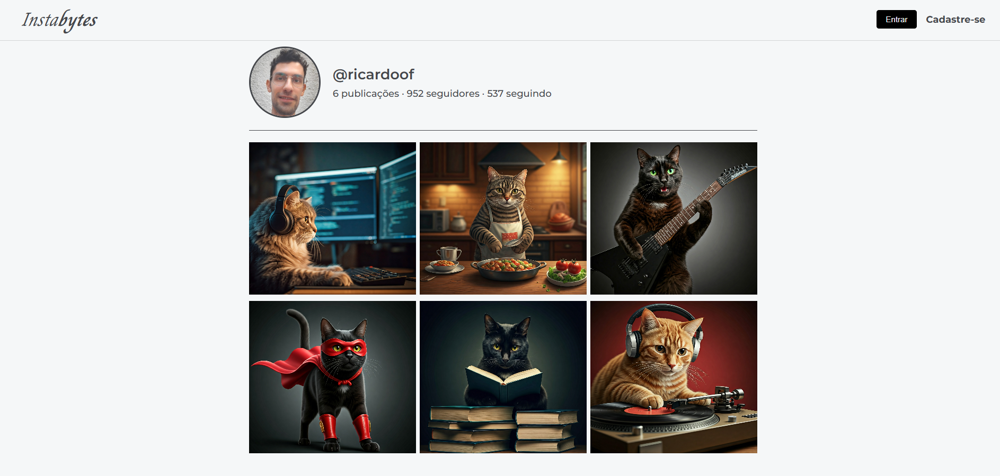
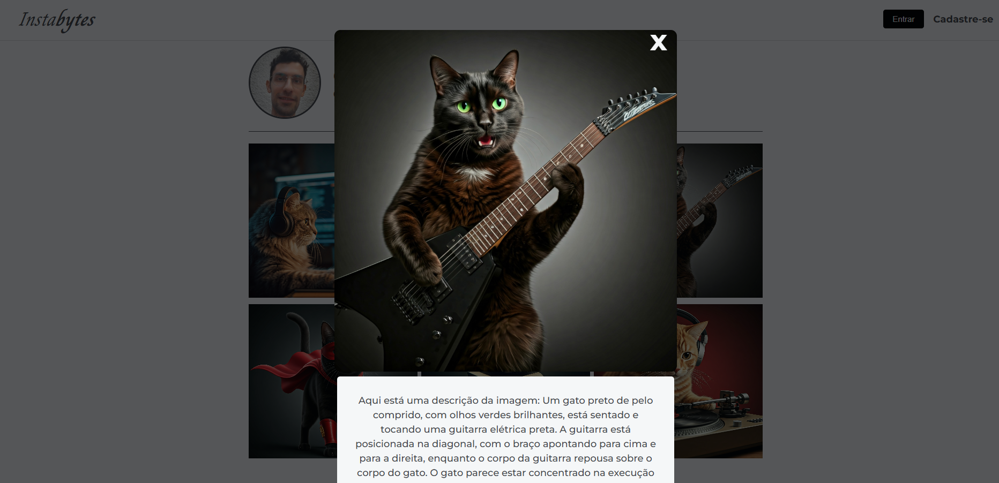

## InstaBytes 
Este projeto foi desenvolvido na imersão back-end da Alura e é uma rede social de fotos que usa o MongoDB e a descrição das fotos é feita usando o Google Gemini.

## Tecnologias
- HTML
- CSS
- JavaScript
- Node
- MongoDB
